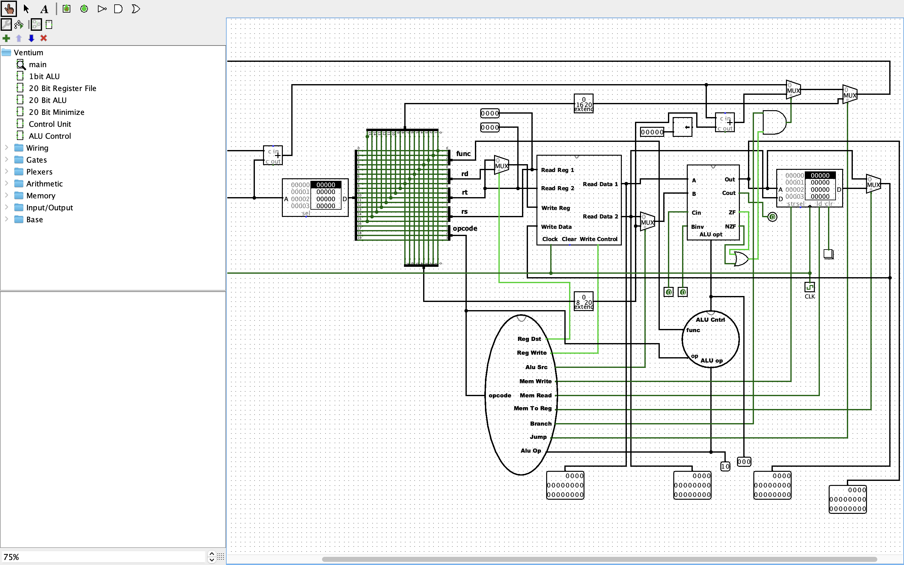

# Ventium - 20 Bit CPU



Welcome to the **Ventium** project! This README provides an overview of the project, setup instructions, and other relevant details.

## Table of Contents

- [Visit](#visit)
- [About](#about)
- [Features](#features)
- [Installation](#installation)
- [Structure](#structure)
- [Contributors](#contributors)
- [Contributing](#contributing)
- [License](#license)

## Visit

- [Repository](https://github.com/aabubokarr/ventium)

## About

**Ventium** is a custom 20-bit CPU simulated in Logisim. It features a custom Instruction Set Architecture (ISA) supporting arithmetic, logical, branch, and memory operations. The project includes a Python assembler that translates assembly programs into Logisim RAM-compatible hex files.

## Features

- 20 Bit Register File
- 1 & 20 Bit ALU
- Control Unit
- ALU Control

## Installation

1. Clone the repository:
   ```bash
   git clone https://github.com/aabubokarr/ventium.git
   ```
2. Navigate to the project directory:
   ```bash
   cd ventium
   ```
3. Run the Assembler:
   Write your assembly code in `inputs.txt` and run the assembler script:
   ```bash
   python assembler.py
   ```

## Structure

```
ventium/
├── Ventium.circ          # Logisim schematic for the 20-bit CPU design
├── Ventium.docx          # Project design documentation and specification report (Word format)
├── Ventium.pdf           # Project design documentation and specification report (PDF format)
├── assembler.py          # Custom Python assembler script
├── inputs.txt            # Test assembly language program
├── outputs.raw           # Compiled instructions in Logisim v2.0 raw hex format
├── ventium.png           # Block diagram of the CPU architecture
├── LICENSE               # MIT License file
└── README.md             # Project documentation
```

## Contributors

<p align="center">
  <a href="https://github.com/aabubokarr/ventium/graphs/contributors">
    
  </a>
</p>

## Contributing

Contributions are welcome! Please follow these steps:

1. Fork the repository.
2. Create a new branch:
   ```bash
   git checkout -b feature-name
   ```
3. Commit your changes:
   ```bash
   git commit -m "Add feature-name"
   ```
4. Push to the branch:
   ```bash
   git push origin feature-name
   ```
5. Open a pull request.

## License

This project is licensed under the [MIT License](LICENSE).